# SmartMirror - Project Overview Diagrams

High-level architectural overview diagrams for project introduction and presentation.

---

## Diagram 1: High-Level System Architecture

**Description:**  
A simplified view showing the three main layers of the SmartMirror platform: Frontend (MagicMirror), Backend Services (Spring Boot + AI), and Data Layer (PostgreSQL).

```mermaid
graph TB
    subgraph FRONTEND["🖥️ FRONTEND"]
        Mobile["📱<br/>Mobile Device"]
        Tablet["📱<br/>Tablet"]
        Mirror["🪞<br/>Smart Mirror<br/>Display"]
        
        Mobile -.-> UI
        Tablet -.-> UI
        Mirror -.-> UI
        
        UI["MagicMirror UI<br/>Node.js + Electron<br/>Port: 5173"]
    end
    
    subgraph MIDDLEWARE["⚙️ BACKEND SERVICES"]
        SpringBoot["Spring Boot API<br/>Java 17<br/>Port: 8080<br/><br/>• User Management<br/>• Reservations<br/>• Authentication<br/>• QR Codes"]
        
        AI["AI Backend<br/>FastAPI + Python<br/>Port: 8000<br/><br/>• Face Recognition<br/>• LLM Chatbot<br/>• InsightFace Model"]
        
        LLM["Ollama LLM<br/>Local AI Service<br/>Port: 11434<br/><br/>• Conversational AI<br/>• Context-Aware"]
    end
    
    subgraph DATA["💾 DATA LAYER"]
        DB[("PostgreSQL<br/>+ pgvector<br/>Port: 5432<br/><br/>• Users<br/>• Reservations<br/>• Face Embeddings<br/>• Vector Search")]
    end
    
    subgraph EXTERNAL["🌐 EXTERNAL SERVICES"]
        OAuth["OAuth2 Providers<br/>Google • GitHub"]
        Email["Email Service<br/>SMTP"]
        Weather["Weather API<br/>OpenMeteo"]
        News["News Feeds<br/>RSS"]
    end
    
    UI -->|REST API<br/>JSON| SpringBoot
    UI -->|Face & Chat<br/>JSON| AI
    
    SpringBoot -->|JDBC<br/>JPA| DB
    AI -->|pgvector<br/>Embeddings| DB
    AI -->|HTTP| LLM
    AI -.->|User Profile| SpringBoot
    
    SpringBoot -.->|OAuth2| OAuth
    SpringBoot -.->|Notifications| Email
    UI -.->|HTTP| Weather
    UI -.->|HTTP| News
    
    classDef frontend fill:#FF9800,stroke:#E65100,stroke-width:3px,color:#fff
    classDef backend fill:#2196F3,stroke:#0D47A1,stroke-width:3px,color:#fff
    classDef data fill:#4CAF50,stroke:#1B5E20,stroke-width:3px,color:#fff
    classDef external fill:#9C27B0,stroke:#4A148C,stroke-width:2px,color:#fff
    
    class UI frontend
    class SpringBoot,AI,LLM backend
    class DB data
    class OAuth,Email,Weather,News external
```

---

## Diagram 2: Technology Stack Overview

**Description:**  
Visual representation of the complete technology stack used in the SmartMirror project, organized by layer.

---

## Diagram 3: Data Flow - User Journey

**Description:**  
Complete user journey showing how data flows through the system from user interaction to response.

```mermaid
graph TB
    User([👤 User])
    
    subgraph "Step 1: Authentication"
        Login["🔐 Login<br/>Email/Password or OAuth2"]
        FaceAuth["😊 Face Recognition<br/>Biometric Auth"]
    end
    
    subgraph "Step 2: Smart Mirror Interface"
        Dashboard["📊 Dashboard<br/>Personal View"]
        Modules["🧩 Modules<br/>Weather • News • Calendar"]
        Camera["📷 Camera<br/>Live Face Detection"]
        Chat["💬 AI Assistant<br/>LLM Chat"]
    end
    
    subgraph "Step 3: Backend Processing"
        API["🔌 REST API<br/>Spring Boot"]
        AIService["🤖 AI Service<br/>FastAPI"]
        Business["📋 Business Logic<br/>Reservations • Users"]
        FaceML["🎯 Face ML<br/>InsightFace Model"]
        LLMService["🧠 LLM Service<br/>Ollama"]
    end
    
    subgraph "Step 4: Data Storage"
        UserDB[("👥 Users<br/>PostgreSQL")]
        ReservDB[("📅 Reservations<br/>PostgreSQL")]
        FaceDB[("😊 Face Data<br/>pgvector<br/>512-dim vectors")]
        KnowledgeDB[("📚 Knowledge<br/>FabLab Docs")]
    end
    
    subgraph "Step 5: Response"
        Display["✨ Display<br/>Updated UI"]
        Notification["📧 Notifications<br/>Email/In-App"]
        QRCode["📱 QR Code<br/>Access Token"]
    end
    
    User -->|Interacts| Login
    User -->|Scans Face| FaceAuth
    
    Login --> Dashboard
    FaceAuth -->|Extract Embedding| AIService
    
    Dashboard --> Modules
    Dashboard --> Camera
    Dashboard --> Chat
    
    Modules -->|Fetch Data| API
    Camera -->|Send Image| AIService
    Chat -->|Send Message| AIService
    
    API --> Business
    AIService --> FaceML
    AIService --> LLMService
    
    Business --> UserDB
    Business --> ReservDB
    FaceML --> FaceDB
    LLMService --> KnowledgeDB
    
    UserDB -.->|Return Data| API
    ReservDB -.->|Return Data| API
    FaceDB -.->|Match Vector| FaceML
    KnowledgeDB -.->|Context| LLMService
    
    API -.->|Response| Display
    AIService -.->|AI Response| Display
    API -.->|Trigger| Notification
    API -.->|Generate| QRCode
    
    Display -.->|Show| User
    Notification -.->|Notify| User
    QRCode -.->|Scan| User
    
    classDef userClass fill:#FF6B6B,stroke:#C44569,stroke-width:3px,color:#fff
    classDef authClass fill:#4ECDC4,stroke:#1A535C,stroke-width:2px,color:#fff
    classDef uiClass fill:#95E1D3,stroke:#3D5A80,stroke-width:2px,color:#000
    classDef backendClass fill:#F7DC6F,stroke:#D4AC0D,stroke-width:2px,color:#000
    classDef dataClass fill:#BB8FCE,stroke:#7D3C98,stroke-width:2px,color:#fff
    classDef responseClass fill:#85C1E2,stroke:#3498DB,stroke-width:2px,color:#000
    
    class User userClass
    class Login,FaceAuth authClass
    class Dashboard,Modules,Camera,Chat uiClass
    class API,AIService,Business,FaceML,LLMService backendClass
    class UserDB,ReservDB,FaceDB,KnowledgeDB dataClass
    class Display,Notification,QRCode responseClass
```

---

## Diagram 4: Simplified Architecture (GraphQL-Style)

**Description:**  
Clean, simplified architecture showing frontend clients, API gateway layer, backend services, and database - similar to a GraphQL architecture pattern.

```mermaid
graph LR
    subgraph CLIENTS["📱 CLIENTS"]
        Mobile["Mobile<br/>Device"]
        Desktop["Desktop<br/>Browser"]
        SmartMirror["Smart<br/>Mirror"]
    end
    
    subgraph GATEWAY["🔌 API GATEWAY LAYER"]
        REST["REST API<br/>http://backend:8080/api<br/><br/>types<br/>queries<br/>mutations"]
        WS["WebSocket<br/>socket.io<br/><br/>real-time events"]
    end
    
    subgraph SERVICES["⚙️ SERVICES LAYER"]
        Auth["Authentication<br/>Service<br/><br/>• JWT<br/>• OAuth2<br/>• Face Auth"]
        
        User["User<br/>Service<br/><br/>• CRUD<br/>• Profiles<br/>• Roles"]
        
        Reservation["Reservation<br/>Service<br/><br/>• Create<br/>• Update<br/>• QR Codes"]
        
        AI["AI<br/>Service<br/><br/>• Face Rec<br/>• LLM Chat<br/>• Vectors"]
    end
    
    subgraph PERSISTENCE["💾 PERSISTENCE LAYER"]
        AppDB[("Application<br/>Database<br/><br/>PostgreSQL")]
        VectorDB[("Vector<br/>Store<br/><br/>pgvector")]
        Cache[("Cache<br/>Layer<br/><br/>In-Memory")]
    end
    
    Mobile -->|HTTP/WS| REST
    Desktop -->|HTTP/WS| REST
    SmartMirror -->|HTTP/WS| REST
    
    Mobile -.->|Real-time| WS
    Desktop -.->|Real-time| WS
    SmartMirror -.->|Real-time| WS
    
    REST --> Auth
    REST --> User
    REST --> Reservation
    REST --> AI
    
    WS -.-> Auth
    WS -.-> User
    
    Auth --> AppDB
    User --> AppDB
    Reservation --> AppDB
    AI --> VectorDB
    AI --> AppDB
    
    Auth -.-> Cache
    User -.-> Cache
    
    AppDB -.-> VectorDB
    
    classDef clients fill:#FF9800,stroke:#E65100,stroke-width:3px,color:#fff
    classDef gateway fill:#2196F3,stroke:#0D47A1,stroke-width:3px,color:#fff
    classDef services fill:#4CAF50,stroke:#1B5E20,stroke-width:3px,color:#fff
    classDef persistence fill:#9C27B0,stroke:#4A148C,stroke-width:3px,color:#fff
    
    class Mobile,Desktop,SmartMirror clients
    class REST,WS gateway
    class Auth,User,Reservation,AI services
    class AppDB,VectorDB,Cache persistence
```

---

## Diagram 5: Docker Container Architecture

**Description:**  
Infrastructure overview showing all Docker containers, volumes, and network connectivity.

---

## Diagram 6: Feature Map

**Description:**  
Overview of all major features and capabilities of the SmartMirror platform.

---

