# SmartMirror - Technical Architecture Diagrams

This document contains all technical diagrams required for a comprehensive presentation of the SmartMirror project.

---

## 1. System Context Diagram (C4 Level 1)

**Description:**  
This diagram shows the SmartMirror system boundary, its primary users (End Users, Administrators), and external systems it integrates with (Ollama LLM, OAuth Providers, Email Service, External APIs for weather/news).

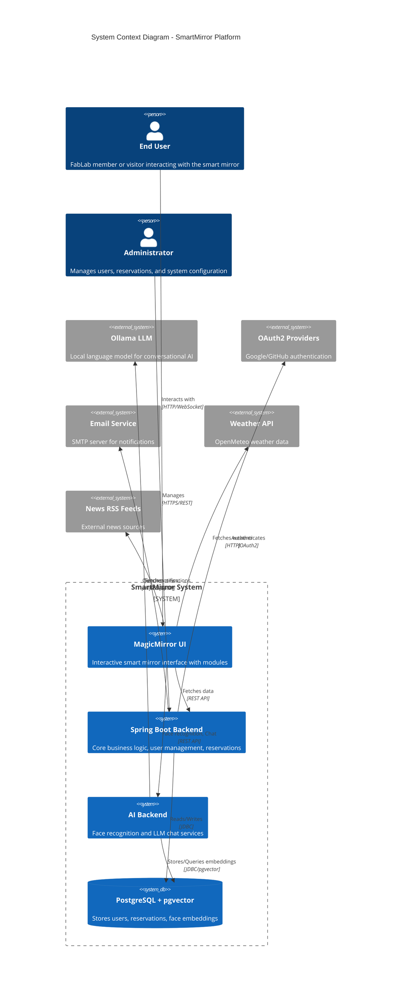

---

## 2. Container Diagram (C4 Level 2)

**Description:**  
This diagram shows the major containers (deployable components) within the SmartMirror system: MagicMirror Frontend, Spring Boot Backend API, FastAPI AI Backend, PostgreSQL with pgvector extension, and Ollama LLM service. It also depicts how these containers communicate.

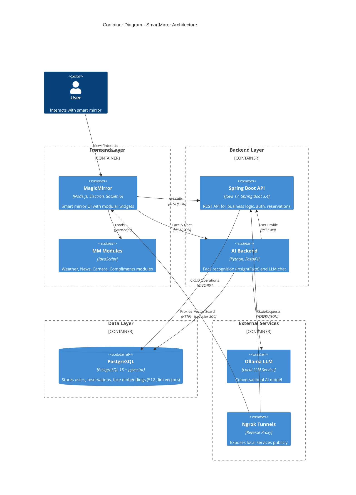

---

## 3. Component Diagram - Spring Boot Backend

**Description:**  
This diagram details the internal components of the Spring Boot backend container, showing controllers, services, repositories, security configuration, and their interactions.

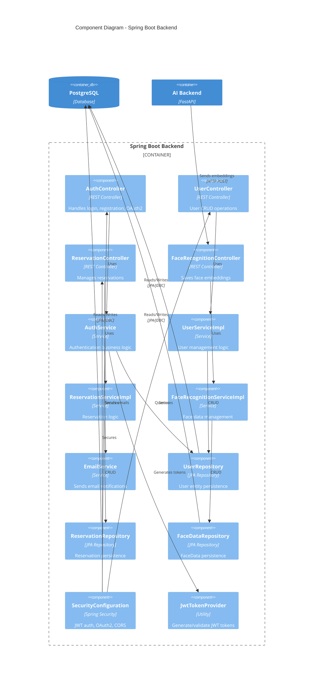

---

## 4. Component Diagram - AI Backend (FastAPI)

**Description:**  
This diagram shows the internal structure of the AI Backend, including API routes, services for face recognition and LLM integration, and the models/detectors used.

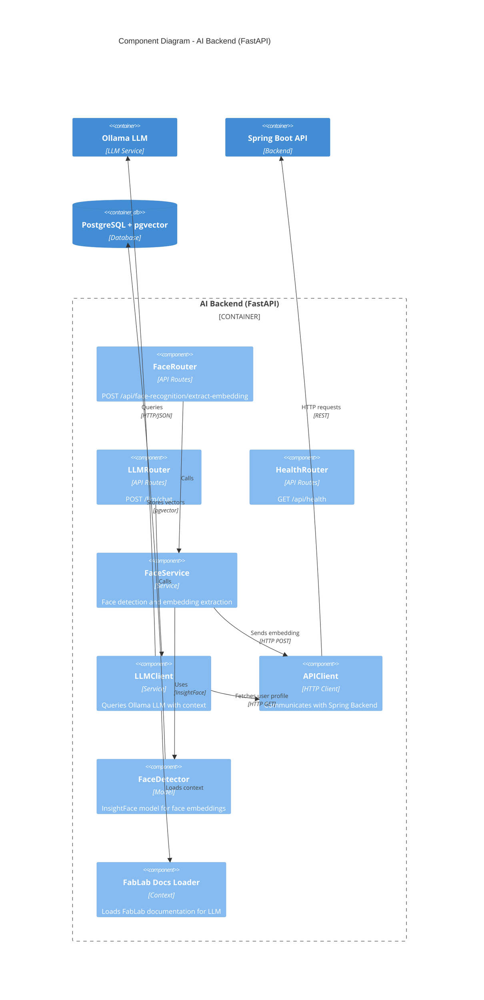

---

## 5. Class Diagram - Core Domain Models

**Description:**  
This UML class diagram represents the main domain entities in the Spring Boot backend: User (with Employee and Client subtypes), Reservation, FaceData, and UserConnectedAccount. It shows their attributes, relationships, and inheritance hierarchy.

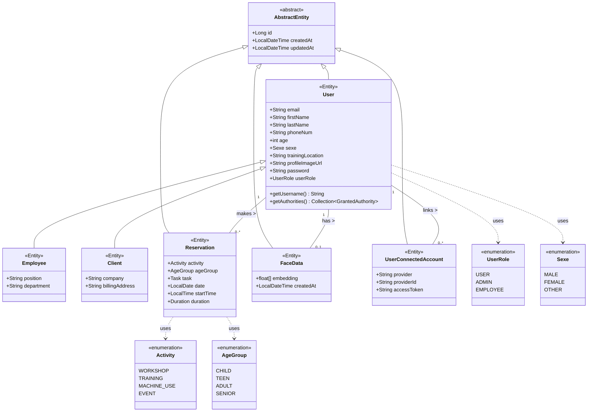

---

## 6. Sequence Diagram - User Authentication Flow (Login)

**Description:**  
This sequence diagram illustrates the authentication workflow when a user logs in using email/password. It shows interaction between the MagicMirror UI, Spring Boot backend, security components, and database.

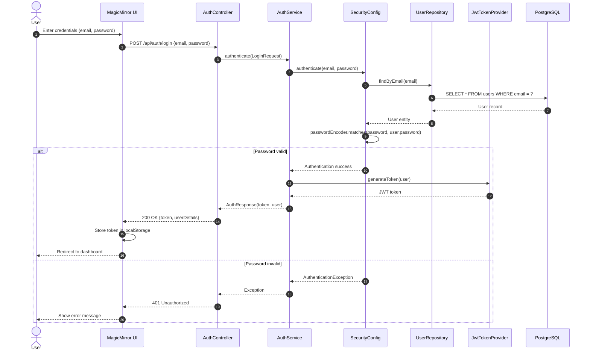

---

## 7. Sequence Diagram - Face Recognition Flow

**Description:**  
This sequence diagram depicts the workflow when a user registers their face embedding. It involves capturing an image, extracting the embedding via AI Backend (InsightFace), and storing it in the database via Spring Boot backend.

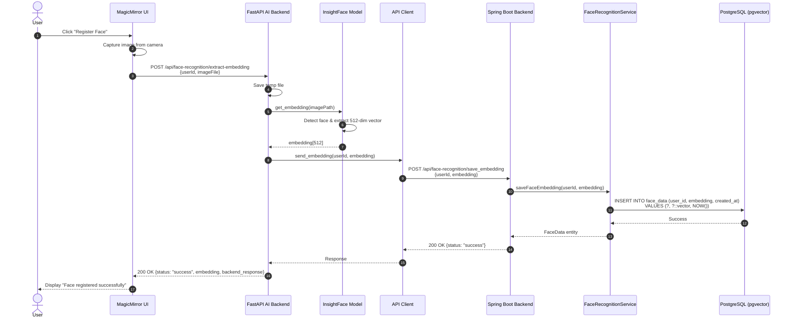

---

## 8. Sequence Diagram - LLM Chat Flow

**Description:**  
This diagram shows how a user interacts with the LLM chatbot. The AI Backend fetches the user profile from Spring Boot, enriches the prompt with FabLab documentation context, and queries the Ollama LLM service.

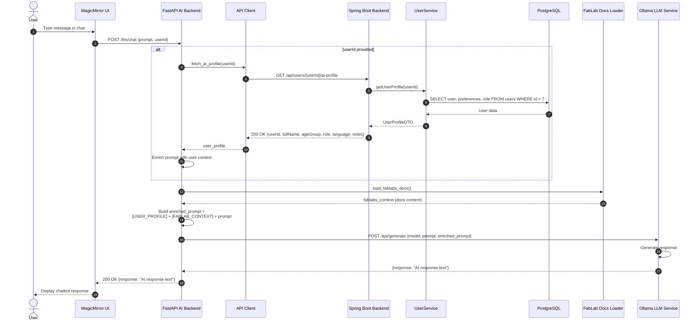

---

## 9. Deployment Diagram

**Description:**  
This diagram illustrates how the SmartMirror system components are deployed across Docker containers, showing the infrastructure setup with Docker Compose, networking, volumes, and external service connections.

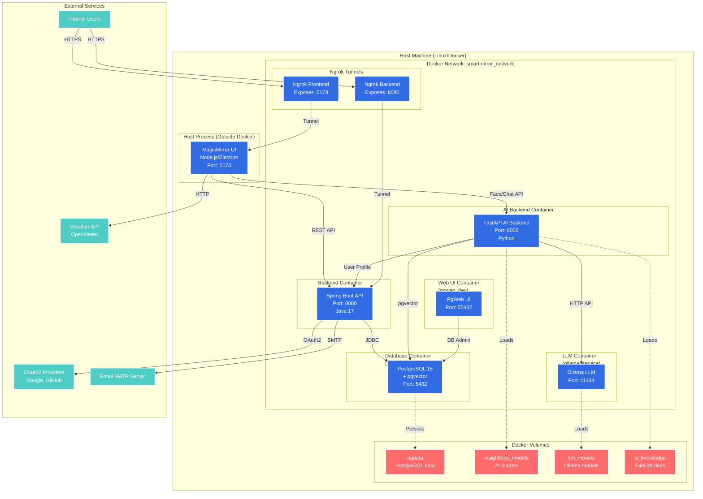

---

## 10. Database ER Diagram

**Description:**  
Entity-Relationship diagram showing the database schema with tables for users, reservations, face_data (with pgvector embeddings), and user_connected_accounts. The diagram shows primary keys, foreign keys, and key attributes.

```mermaid
erDiagram
    USERS ||--o{ RESERVATIONS : makes
    USERS ||--o| FACE_DATA : has
    USERS ||--o{ USER_CONNECTED_ACCOUNTS : links
    
    USERS {
        bigint id PK
        varchar email UK
        varchar first_name
        varchar last_name
        varchar phone_num
        int age
        varchar sexe
        varchar training_location
        varchar profile_image_url
        varchar password
        varchar user_role
        varchar user_type
        timestamp created_at
        timestamp updated_at
    }
    
    RESERVATIONS {
        bigint id PK
        bigint user_id FK
        varchar activity
        varchar age_group
        varchar task
        date date
        time start_time
        interval duration
        timestamp created_at
        timestamp updated_at
    }
    
    FACE_DATA {
        bigint id PK
        bigint user_id FK UK
        vector_512 embedding
        timestamp created_at
        timestamp updated_at
    }
    
    USER_CONNECTED_ACCOUNTS {
        bigint id PK
        bigint user_id FK
        varchar provider
        varchar provider_id
        varchar access_token
        timestamp created_at
        timestamp updated_at
    }
```

---

## 11. State Machine Diagram - Reservation Lifecycle

**Description:**  
This state diagram represents the lifecycle of a reservation entity, from creation through various states (pending, confirmed, in-progress, completed, cancelled) based on user and system actions.

**Assumption:** The reservation system includes status tracking (not explicitly found in current code, but typical for reservation systems).

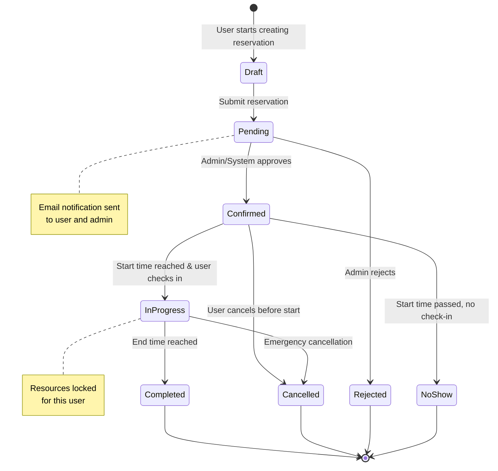

---

## 12. Component Interaction Diagram - MagicMirror Modules

**Description:**  
This diagram shows how MagicMirror's modular architecture works, with the core application loading and communicating with various modules (weather, news, camera, compliments, custom modules) via Socket.io and the module API.

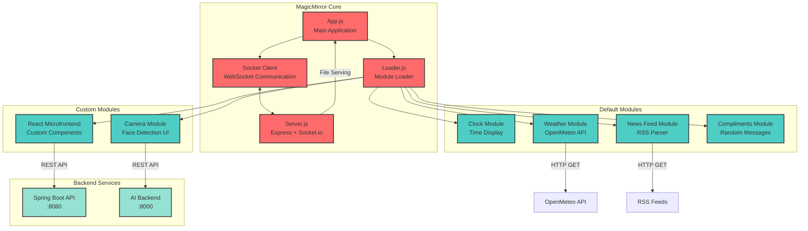

---

## 13. CI/CD Pipeline Flow (Assumed)

**Description:**  
This diagram represents a typical CI/CD pipeline for the SmartMirror project. While not explicitly defined in the repository, this shows a standard workflow for development, testing, building, and deployment.

**Assumption:** CI/CD pipeline using GitHub Actions or similar CI tool.

```mermaid
flowchart LR
    Start([Developer Push]) --> GitCommit[Git Commit<br/>to main/develop]
    GitCommit --> Trigger[Trigger CI Pipeline]
    
    Trigger --> Lint{Code Quality<br/>Checks}
    Lint -->|ESLint, Prettier| LintJS[Lint JavaScript]
    Lint -->|Maven Checkstyle| LintJava[Lint Java]
    Lint -->|Black, Flake8| LintPython[Lint Python]
    
    LintJS --> Test
    LintJava --> Test
    LintPython --> Test
    
    Test{Run Tests} -->|Jest| TestFrontend[Frontend Tests]
    Test -->|JUnit| TestBackend[Spring Tests]
    Test -->|Pytest| TestAI[AI Backend Tests]
    
    TestFrontend --> Build
    TestBackend --> Build
    TestAI --> Build
    
    Build{Build<br/>Artifacts} -->|npm build| BuildFE[Build MagicMirror]
    Build -->|Maven package| BuildBE[Build Spring JAR]
    Build -->|Docker build| BuildAI[Build AI Image]
    
    BuildFE --> DockerCompose
    BuildBE --> DockerCompose
    BuildAI --> DockerCompose
    
    DockerCompose[Build Docker Images] --> Push[Push to Registry<br/>Docker Hub/GHCR]
    Push --> Deploy{Deploy}
    
    Deploy -->|Dev| DevEnv[Dev Environment]
    Deploy -->|Staging| StagingEnv[Staging Environment]
    Deploy -->|Prod| ProdEnv[Production Environment]
    
    DevEnv --> Notify
    StagingEnv --> Notify
    ProdEnv --> Notify
    
    Notify[Notify Team<br/>Slack/Email] --> End([Pipeline Complete])
    
    classDef checkNode fill:#FFD93D,stroke:#333,stroke-width:2px
    classDef buildNode fill:#6BCB77,stroke:#333,stroke-width:2px
    classDef deployNode fill:#4D96FF,stroke:#333,stroke-width:2px
    
    class Lint,Test checkNode
    class Build,DockerCompose,Push buildNode
    class Deploy,DevEnv,StagingEnv,ProdEnv deployNode
```

---

## 14. Data Flow Diagram - Face Recognition System

**Description:**  
This DFD shows how data flows through the face recognition subsystem: from image capture, through embedding extraction, storage in pgvector database, and retrieval for authentication/matching.

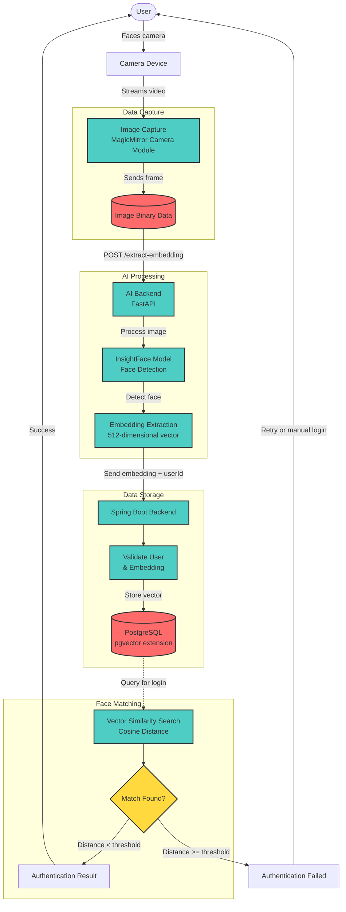

---

## 15. Architecture Decision Records (ADR) Summary Diagram

**Description:**  
This diagram visualizes key architectural decisions made in the SmartMirror project, showing technology choices and their justifications.

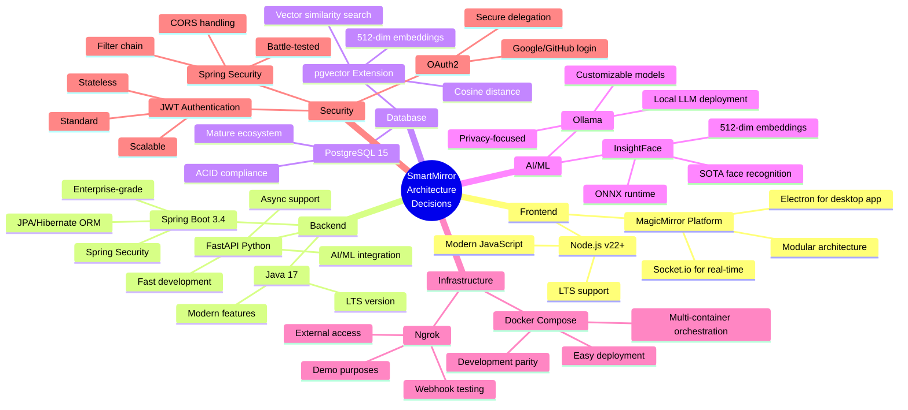

---

## Summary

These 15 comprehensive diagrams provide a complete technical overview of the SmartMirror project:

1. **System Context** - High-level view of users, system, and external dependencies
2. **Container Diagram** - Major deployable components and their interactions
3. **Component Diagram (Spring Boot)** - Internal structure of backend API
4. **Component Diagram (AI Backend)** - Internal structure of AI services
5. **Class Diagram** - Core domain model entities and relationships
6. **Sequence Diagram (Authentication)** - Login workflow
7. **Sequence Diagram (Face Recognition)** - Face registration process
8. **Sequence Diagram (LLM Chat)** - Chatbot interaction flow
9. **Deployment Diagram** - Docker infrastructure and networking
10. **Database ER Diagram** - Data model and relationships
11. **State Machine Diagram** - Reservation lifecycle states
12. **Component Interaction** - MagicMirror module architecture
13. **CI/CD Pipeline** - Build and deployment workflow (assumed)
14. **Data Flow Diagram** - Face recognition data processing
15. **ADR Summary** - Architectural decision visualization

These diagrams are ready for use in technical presentations, documentation, or architectural reviews. They follow standard notations (C4, UML, ERD) and can be rendered using Mermaid-compatible tools.
